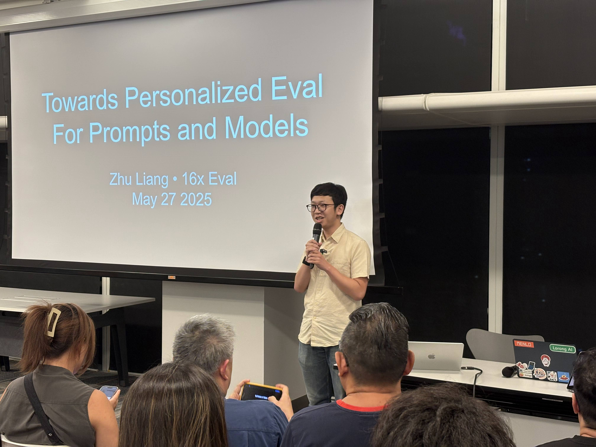
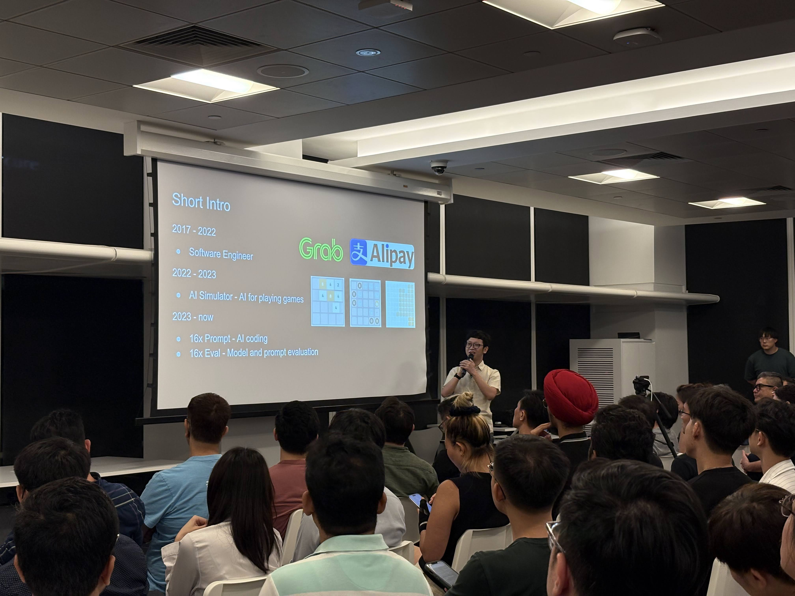
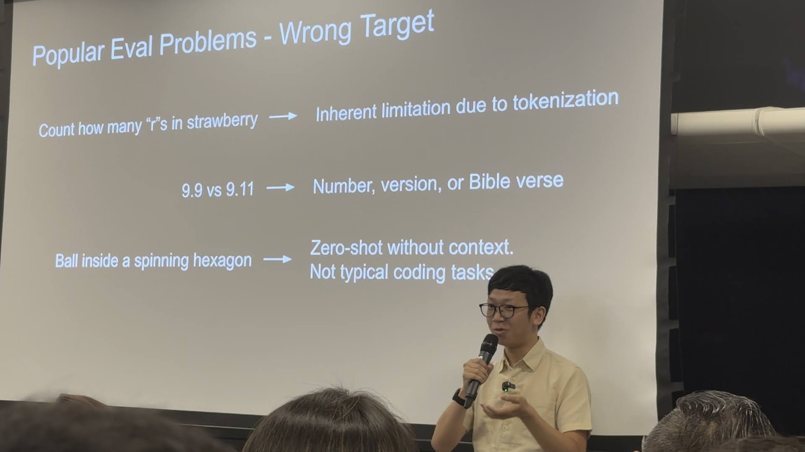

# Speaking Engagements

## Towards Personalized Evaluation for Prompts and Models

Event Details:

- Event: Singapore AI Showcase (May 2025)
  - https://lu.ma/oazupw94?tk=2hQMia
- Date: May 27, 2025
- Venue: National Library / Lee Kong Chian Reference Library, Singapore
- Slides for the talk: https://docs.google.com/presentation/d/1GK-9TJGPXk95SjpEg1y9s5kS27hywYOgZQtL6q5xSkQ/edit?usp=sharing

Main topics in the talk:

- Problems of popular evals and benchmarks
  - Data leakage, overfitting, reward hacking, etc.
- Difficulty in evaluating models
  - Models from different providers have different characteristics
  - Different versions of the same model have different characteristics
  - Different types of tasks require different prompting techniques
- Importance of having personalized evals
- Demo of [16x Eval](https://eval.16x.engineer/)

Photos from the event:

