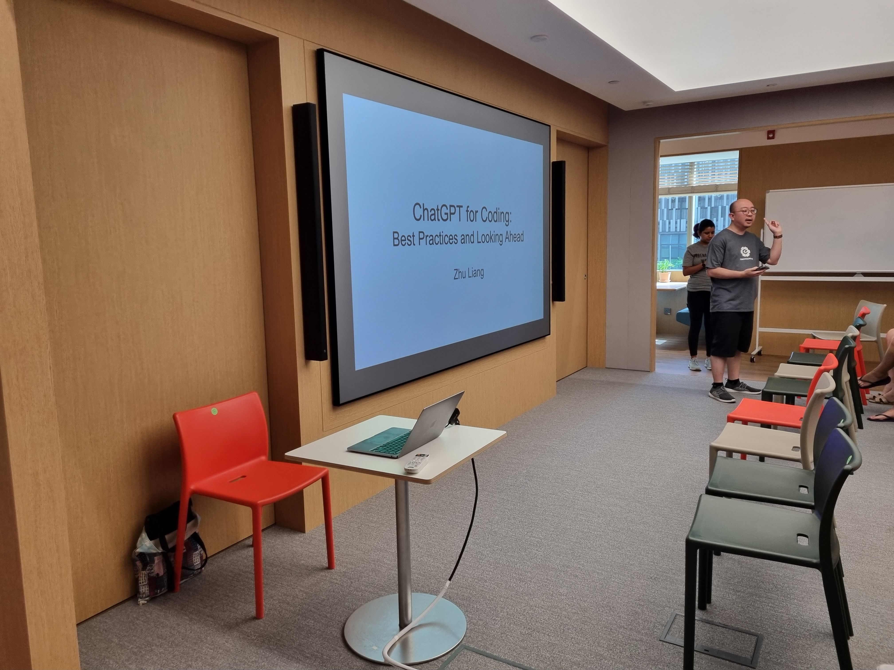
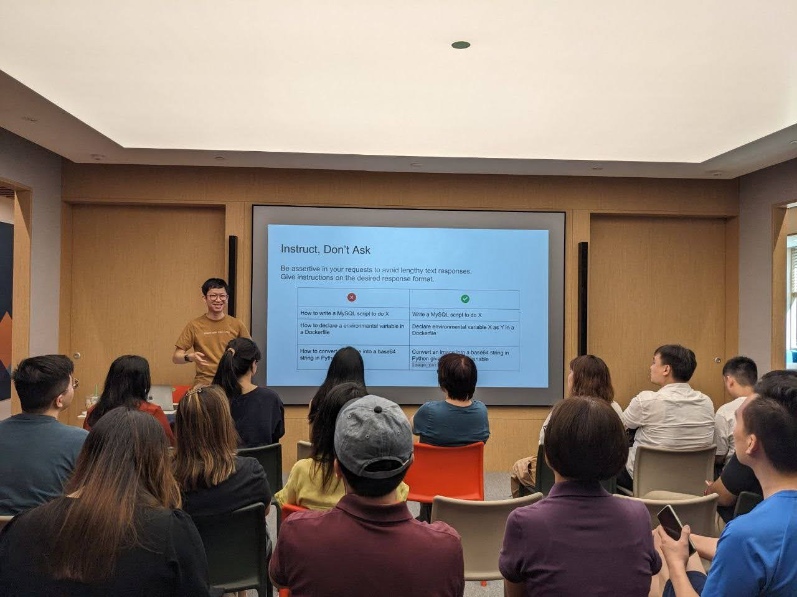
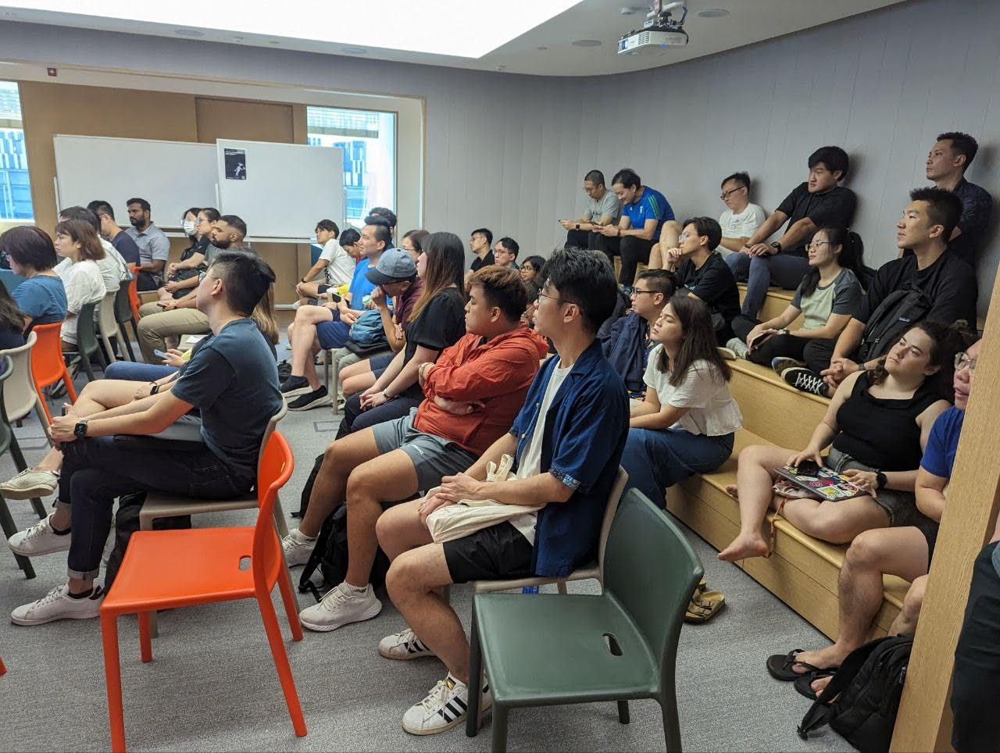

# Speaking Engagements

_This document contains speaking engagements by Zhu Liang._

## Towards Personalized Evaluation for Prompts and Models

Presentation at [Singapore AI Showcase (May 2025)](https://lu.ma/oazupw94?tk=2hQMia):

- Event: Singapore AI Showcase (May 2025)
  - https://lu.ma/oazupw94?tk=2hQMia
- Date: May 27, 2025
- Venue: National Library / Lee Kong Chian Reference Library, Singapore
- Talk Slides: [Google Slides](https://docs.google.com/presentation/d/1GK-9TJGPXk95SjpEg1y9s5kS27hywYOgZQtL6q5xSkQ/edit?usp=sharing)

Main topics in the talk:

- Problems of popular evals and benchmarks
  - Data leakage, overfitting, reward hacking, etc.
- Difficulty in evaluating models
  - Models from different providers have different characteristics
  - Different versions of the same model have different characteristics
  - Different types of tasks require different prompting techniques
- Importance of having personalized evals
- Demo of [16x Eval](https://eval.16x.engineer/)

Photos from the event:

|               |                                                                                                                    |
| ------------- | ------------------------------------------------------------------------------------------------------------------ |
| Title slide   |                 |
| Introduction  |                  |
| Popular Evals |  |

## Building My Own AI-SDK

Presentation at [AI Tinkerers Singapore: May Meetup](https://singapore.aitinkerers.org/p/ai-tinkerers-singapore-may-meetup-may-21st-2025):

- Event: AI Tinkerers Singapore: May Meetup
  - https://singapore.aitinkerers.org/p/ai-tinkerers-singapore-may-meetup-may-21st-2025
- Date: May 21, 2025
- Venue: CloudFlare Office, Singapore

Main topics in the talk:

- Why I built my own AI-SDK - [send-prompt](https://www.npmjs.com/package/send-prompt)
  - Handle edge cases between different model providers and models
  - Have a one unified library for all model providers, instead of N libraries for N model providers
- Code walk-through of send-prompt, which is open-sourced on [GitHub](https://github.com/paradite/send-prompt)

## ChatGPT for Coding: Best Practices and Looking Ahead

Presentation at [JuniorDevSG](https://www.meetup.com/junior-developers-singapore/events/299967566/):

- Event: Developers' Gym - ChatGPT for Coding: Best Practices and Looking Ahead
  - https://www.meetup.com/junior-developers-singapore/events/299967566/
- Date: April 13, 2024
- Venue: Thoughtworks Office, Singapore
- Talk Slides: [Google Slides](https://docs.google.com/presentation/d/1XkbRoqlpjsULox88Uu2TOK8_aQ0spN4VChR1Vh5aNKc/edit?usp=sharing)

Main topics in the talk:

- How to use ChatGPT effectively for daily coding tasks to become more productive, with practical examples
- Deeper dive into what LLMs can do and their limitations
- Best practices for AI-assisted coding
- Looking ahead at future developments in AI for coding

Photo from the event:

|                    |                                                                                                           |
| ------------------ | --------------------------------------------------------------------------------------------------------- |
| Title slide        |                           |
| Insruct, Don't Ask |  |
| Audience           |                     |
